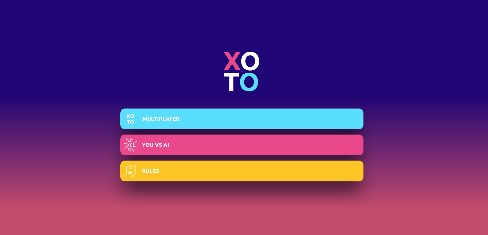

# JavaScript Tic-Tac-Toe

In this project we created a Tic-Tac-Toe game. It has the following fuctionalities:
- player creation;
- score victories;
- user interface.

You can find the original description in [The Odin Project](https://www.theodinproject.com/courses/javascript/lessons/tic-tac-toe-javascript)

## Built With

- HTML5 
- Sass
- JavaScript

## Live Demo

[Live Demo Link](https://rawcdn.githack.com/nicolasmarino99/Tic-Tac-Toe/c5dc04b422b4ebe2c9ff7c3f26bce5ca9d71d431/index.html)

## Getting Started

Access the live demo website and click on multiplayer. Fill up the form with the name of the two players and hit enter to start playing. To make the moves, click on the position in the board. To reset the game, click on the icon on the top right corner.

### Prerequisites
- web browser

## Authors

:man: **Nicolás Mariño Parra**

- Github: [@nicolasmarino99](https://github.com/nicolasmarino99)
- Twitter: [@nicolasmarino99](https://twitter.com/nicolasmarino99)
- Linkedin: [Nicolás Mariño Parra](https://www.linkedin.com/in/nicol%C3%A1s-mari%C3%B1o-parra-45a707177/)

:woman: **Bruna Genz**

- Github: [@bruna-genz](https://github.com/bruna-genz)
- Twitter: [@Bruna_GK](https://twitter.com/Bruna_GK)
- Linkedin: [Bruna Genz](https://www.linkedin.com/in/brunagenz/)

## 🤝 Contributing

Contributions, issues and feature requests are welcome!

## Show your support

Give a ⭐️ if you like this project!
