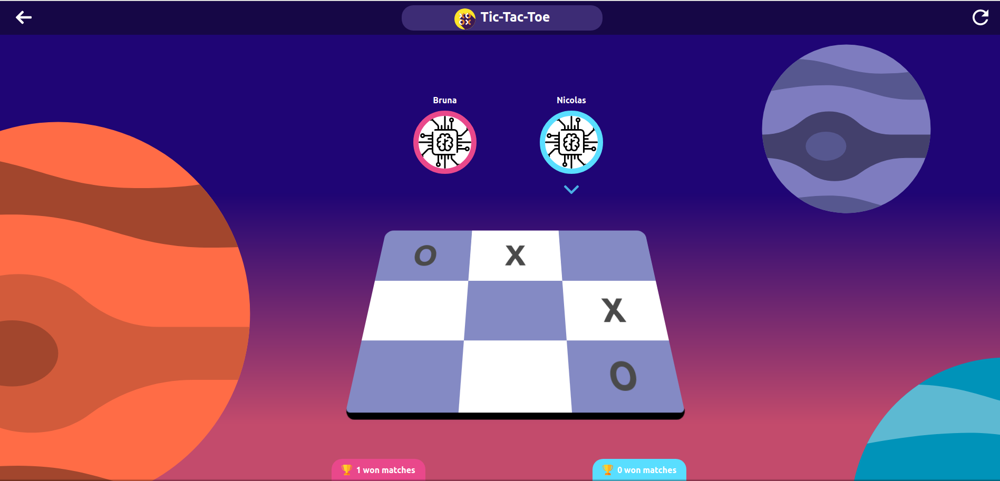

# JavaScript Tic-Tac-Toe

> In this project we created a Tic-Tac-Toe game with unit Testing. It has the following fuctionalities:
- player creation;
- score victories;
- user interface.

You can find the original description in [The Odin Project](https://www.theodinproject.com/courses/javascript/lessons/tic-tac-toe-javascript)

## Built With

- HTML5 
- Sass
- JavaScript
- webpack 3
- npm
- babel
- Jest

## Live Demo

[Live Demo Link](https://rawcdn.githack.com/nicolasmarino99/Tic-Tac-Toe/3e25b8e70780e3a44724cf21789a364aa5f8a11e/index.html)

## Getting Started

Download or clone the project [here](https://github.com/nicolasmarino99/tic-tac-toe.git), then enter in the project's directory from the terminal and run the following comands:

- `npm i`
- `npm run start`

If you want to run the test from this project type:

- `npm run test`

### Prerequisites
- web browser

## Authors

:man: **Nicolás Mariño Parra**

- Github: [@nicolasmarino99](https://github.com/nicolasmarino99)
- Twitter: [@nicolasmarino99](https://twitter.com/nicolasmarino99)
- Linkedin: [Nicolás Mariño Parra](https://www.linkedin.com/in/nicol%C3%A1s-mari%C3%B1o-parra-45a707177/)

:woman: **Bruna Genz**

- Github: [@bruna-genz](https://github.com/bruna-genz)
- Twitter: [@Bruna_GK](https://twitter.com/Bruna_GK)
- Linkedin: [Bruna Genz](https://www.linkedin.com/in/brunagenz/)

## 🤝 Contributing

Contributions, issues and feature requests are welcome!

## Show your support

Give a ⭐️ if you like this project!
